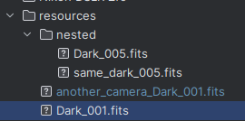
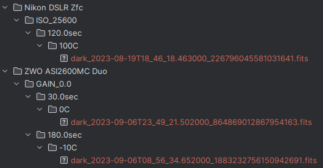
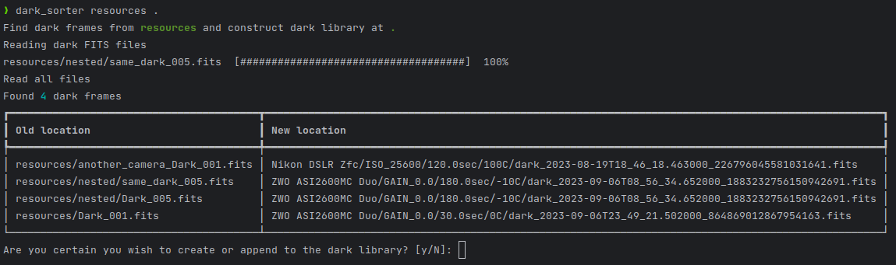

# dark-sorter

Dark Sorter is a Python-based utility designed to automatically sort Astrophotography Dark frames. It categorizes the
dark frames based on various parameters such as camera model, gain/ISO settings, temperature, and exposure time. This
utility comes with a Command-Line Interface (CLI) for ease of use.

## From



## To



## CLI


# Features

* Camera Sorting: Sorts dark frames based on the camera model.
* Gain/ISO Sorting: Categorizes frames based on gain or ISO settings.
* Temperature Sorting: Sorts frames according to temperature conditions, with a precision of 1°C.
* Exposure Time Sorting: Organizes dark frames by their exposure time.
* Duplication Detection: Identifies and avoids creating duplicate frames in the output directory.
* CLI Interface: Easy-to-use command-line interface for quick sorting.

# Prerequisites

* Python 3.11+

# Installation

```bash
pip install darksorter
```

# Usage

```bash
darksorter where/i/have/all/my/fits new/dark/location
```

# CLI Options

```bash
darksorter --help
```

# Contributing

If you wish to contribute to this project, please submit a pull request or open an issue for discussion.

# License

This project is licensed under the MIT License
